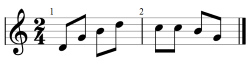

# Сон про краску

Иду я из школы в раздевалку, смотрю - а вместо раздевалки какие-то дядьки стоят
в костюмах аквалангистов и поджидают. А со мной шел мой приятель Игорь. Раз - и
из раздевалки полилась краска, тогда я пошагал обратно. Игорь не понял ничего и
пошел в раздевалку. И его залило краской. Я пошел говорить об этом маме, а она
сказала своим ученикам: Ксюше и Кате. Затем я пошел говорить об этом всем.
Некоторые люди были за решеткой, но решетка была настолько поднята, что можно
было под ней пройти. Я подумал, что они тупые что ли, т.к. не могли нагнуться и
пройти под ней. И тогда я сказал, чтобы они прошли под ней. И они прошли.
Мы с Мамой, с ее учениками и со всеми учителями и школьниками пошли наверх:
сначала на второй этаж, потом на третий, потом на четвертый, а затем на крышу.
Но краска добралась и дотуда. Она почти затопила всю крышу. Но вот я увидел
какого-то человека, который сел на колени. Но не мог понять: зачем он это сделал.
И вдруг я увидел вверху господа. Потом это превратилось в икону.
Дяденька на иконе умолял, чтобы краска пропала. Затем это все превратилось
в настоящее, и бог спас всех от затопления краски. Но еще бог надул Игоря и сдул
чуть-чуть. Хорошо что господ оживил его.

На следующий день я опять иду из школы в раздевалку, только уже без Игоря,
и вижу опять люди в водолазных костюмах поджигают что-то. Я побежал к маме в кабинет.
Там были: Ксюша, Катя, мой папа, моя сестра, моя мама и подружки моей сестры -
Инна и Света. Мы все пошли к выходу (краска сначала текла медленно, а потом быстро).
Незаметно прошли между этих дядек. К школе направлялась какая-то бабушка,
мы сказали, что идите обратно. Она спросила: Почему? Мы ответили: там льется краска.
Но бабусенька не поверила и пошла туда. Затем мы побежали за школу. У папы были
такие часы, которые могли определять расстояние, но вот он определил, что от
школы до нас то ли 27 метров, то ли 69. Краска уже выливалась из окон!
Потом мы бежали по Митинской улице - там что-то рыли. Маша со Светой почему-то
отставали. Далее мы повернули на дорогу - в дальний лес и пошли туда. Но в лес
мы не пошли, а остановились около домов, которые строились, забрались на маленькую
вышку, но вдруга она превратилась в наш комплекс (домашний спортивный), а на нем
были подушки наши оранжевые. Как-то укрылись. Краска залила уже практически все,
только остался островок, на котором и стоял комплекс. Вдруг послышалась музыка:

После этого краска начала сливаться и слилась вся. Эта краска была зеленая.

> Этот сон приснился мне примерно в 10-летнем возрасте. Он сильно впечатлил
> своим сюжетом и деталями, что я даже захотел его записать. Но после него я
> серьезно заболел, прямо на следующее утро.